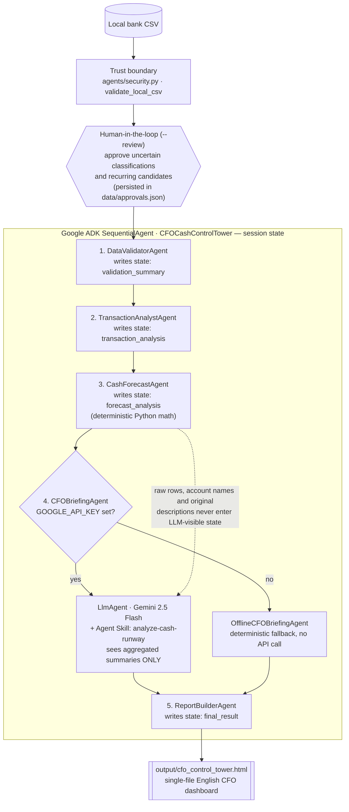

# Start-up Daily CF Report

**One bank CSV in → how much cash you have, when it runs out, and what to do before it does.**

This repository uses a fully synthetic company and bank transaction dataset. No real company names, accounts, counterparties, dates, or amounts are included.

## The Problem

Small-company cash management is often fragmented across bank exports, daily cash sheets, and monthly cash-flow models. A bank balance shows what exists now, but not when liquidity becomes unsafe or which action must happen first. Bank transactions also do not contain confirmed future contracts, tax schedules, debt maturities, or new sales, so forecasts can easily be presented with more certainty than the data supports.

## The Solution

Start-up Daily CF Report validates a local bank CSV, classifies transactions, detects recurring candidates, requests human approval for uncertainty, and calculates three deterministic scenarios. It produces:

- a daily 90-day cash forecast;
- a monthly 12-month cash outlook;
- operating burn, minimum cash reserve, and cash runway;
- projected reserve-breach and cash-depletion dates;
- a concise CFO briefing and a single-file English HTML dashboard;
- a watched `inbox/` folder for the daily routine — drop a CSV, the report rebuilds itself.

All money math is deterministic Python. The LLM explains verified calculation summaries; it never calculates financial amounts.

## Architecture



| # | Agent | Responsibility |
|---|---|---|
| 1 | DataValidatorAgent | Normalizes bank CSV headers, checks amounts, and reconciles balance continuity |
| 2 | TransactionAnalystAgent | Classifies transactions and summarizes recurring candidates and review items |
| 3 | CashForecastAgent | Runs deterministic 90-day daily and 12-month monthly forecasts across three scenarios |
| 4 | CFOBriefingAgent | Uses Gemini with the `analyze-cash-runway` skill, or a deterministic offline fallback |
| 5 | ReportBuilderAgent | Renders the final single-file English HTML dashboard |

## Course Concepts Demonstrated

This project demonstrates 3 of the 6 course concepts (minimum required: 3), all verifiable in code:

| Concept | Where in code | What it proves |
|---|---|---|
| **ADK multi-agent** | `cfo_adk/agent.py:139-153` | `CFOCashControlTower` chains five processing agents with `SequentialAgent` |
| ADK custom agents and session state | `cfo_adk/agent.py:23-28`, state writes in `:42`, `:57`, `:77`, `:102`, `:114` | `BaseAgent` stages pass serializable aggregate summaries through `EventActions(stateDelta=...)` |
| **Agent Skills** | `cfo_adk/skills/analyze-cash-runway/SKILL.md` and three policy references; loaded at `cfo_adk/agent.py:119-120` | The Gemini briefing is governed by packaged forecasting, briefing, and security policies |
| **Security**: local trust boundary | `agents/security.py:11-27`, `:30-39` | CSV and HTML paths remain inside the workspace; file type and 10 MB size limits are enforced |
| Security: LLM data minimization | `cfo_adk/agent.py:56`, `:125-131` | Raw rows, account names, and transaction descriptions are not placed in LLM-visible state; `include_contents="none"` restricts conversation input |
| Security: human approval | `agents/pipeline.py:24-40`, `agents/categorizer.py:34-57`, `main.py:84` | Uncertain classifications and recurring candidates require explicit `--review` approval and are never auto-approved |
| Offline resilience | `cfo_adk/agent.py:80-103`, `main.py:34-35` | The complete five-agent workflow runs without API keys |

## Security & Privacy by Design

- Only local `.csv` files inside the project workspace are accepted.
- Input size is capped at 10 MB; report output must remain inside the workspace.
- Raw bank rows, account names, and original transaction descriptions are never sent to Gemini.
- The language model receives only aggregated, serializable summaries.
- Uncertain classifications and recurring candidates require human approval.
- API keys stay in environment variables; `.env`, approvals, Excel files, and generated reports are excluded from Git.
- The full workflow has an offline briefing fallback.

See [SECURITY.md](SECURITY.md) for the release checklist.

## Setup & Quickstart

Python 3.10 or later is required. Use a virtual environment to avoid dependency conflicts.

```powershell
python -m venv .venv
.venv\Scripts\Activate.ps1
python -m pip install -r requirements.txt
python main.py sample_bank_data.csv
```

The command runs the five-stage ADK workflow and writes `output/cfo_control_tower.html`.

Open the report automatically:

```powershell
python main.py sample_bank_data.csv --open
```

API keys are optional. Without one, `OfflineCFOBriefingAgent` completes the entire workflow.

## Human-in-the-Loop Review Demo

Run review mode separately when demonstrating approval controls:

```powershell
python main.py sample_bank_data.csv --review --open
```

The CLI asks before uncertain classifications or recurring candidates affect the forecast. Opening balances are identified deterministically and excluded from review and forecast inflows. Approval decisions are stored locally in `data/approvals.json`, which is excluded from Git. CLI prompts are English; transaction descriptions retain the source CSV language.

## Daily Inbox Mode

Start the watcher once, then drop each day's bank CSV into the `inbox/` folder:

```powershell
python watch_inbox.py
```

The watcher detects the new file, runs the same five-agent pipeline (security gate included), refreshes `output/cfo_control_tower.html`, and opens it in the browser. Recurring items approved earlier via `--review` are reused; new uncertain items are conservatively included and disclosed in the report — nothing is auto-approved.

## Running with Google ADK and Gemini

Copy `.env.example` to `.env` and set a Google AI Studio key:

```text
GOOGLE_API_KEY="YOUR_KEY"
```

Never commit `.env` or expose the key in screenshots and videos.

Run the ADK command-line interface:

```powershell
adk run cfo_adk
```

Development-only ADK web interface:

```powershell
adk web --port 8000
```

## Input CSV Format

Required meanings are transaction date, description, withdrawal, and deposit. Balance and account columns are optional but improve current-cash accuracy. The normalizer recognizes supported Korean bank-style headers and common English headers.

```csv
date,description,withdrawal,deposit,balance,account
2025-01-01,Opening Balance,0,420000000,420000000,Demo Operating Account
```

Input must be a non-empty `.csv` file inside the project workspace and no larger than 10 MB.

## Forecast Methodology & Assumptions

- Current cash uses the latest reconciled balance per account when continuity is reliable.
- Operating burn includes operating fixed and variable costs.
- Opening balances, transfers, investing activity, and financing activity are separated from operating burn.
- Unclassified cash movements are conservatively included in operating cash flow while remaining pending review.
- Minimum cash reserve equals six months of normalized operating expenses.
- Approved recurring items are placed on expected dates; unapproved candidates are not commitments.
- Remaining cash flows use historical averages and scenario sensitivity factors.
- Bank CSV data cannot confirm contracts, taxes, debt maturities, or future sales.

This report is decision-support analysis, not a set of financial statements or accounting, tax, legal, or investment advice.

## Testing

```powershell
python -m pytest -q
```

The current 9-test suite covers balance reconciliation, recurring-pattern approval state, 90-day and 12-month outputs, non-CSV and workspace-boundary rejection, the five-agent ADK structure, Agent Skill loading, and an offline ADK-to-HTML integration run.

## Project Structure

- `main.py`: ADK-first CLI entry point and Runner lifecycle
- `watch_inbox.py`: daily inbox watcher — rebuilds the report when a new CSV lands in `inbox/`
- `agents/pipeline.py`: deterministic analysis and report pipeline
- `agents/security.py`: local CSV and report-output trust boundary
- `agents/data_normalizer.py`: CSV normalization and balance validation
- `agents/categorizer.py`: classification suggestions and approval storage
- `agents/recurrence.py`: recurring-candidate detection
- `agents/forecaster.py`: deterministic scenarios and runway calculations
- `agents/cfo_analyst.py`: single-file HTML dashboard renderer
- `cfo_adk/agent.py`: five-agent ADK orchestration
- `cfo_adk/skills/analyze-cash-runway/`: Agent Skill and CFO policy references
- `tests/`: unit and offline ADK integration tests

## References

- [Google ADK Python quickstart](https://adk.dev/get-started/python/)
- [ADK sequential workflow](https://adk.dev/agents/workflow-agents/sequential-agents/)
- [Skills for ADK agents](https://adk.dev/skills/)

## License

This project is released under the [MIT License](LICENSE).

Per the competition rules, if this entry wins, the code will additionally be made available under CC BY 4.0.

## 한국어 요약

Start-up Daily CF Report는 은행 거래 CSV 하나로 현재 현금, 90일·12개월 전망, 런웨이와 우선 조치를 계산하는 자금관리 에이전트입니다. 실제 회사 자료는 사용하지 않으며 제출용 샘플은 완전한 가상 데이터입니다.

금액 계산은 전부 검증 가능한 Python 코드가 수행합니다. Google ADK가 데이터 검증, 거래 분석, 예측, CFO 브리핑, HTML 보고서 생성의 다섯 단계를 관리하며 Gemini는 집계 결과를 설명할 뿐 금액을 계산하지 않습니다.

불확실한 거래 분류와 반복 거래는 `--review`에서 사람이 승인해야 예측에 반영됩니다. API 키가 없어도 오프라인 브리핑으로 전체 파이프라인이 완료됩니다.

가장 간단한 실행 명령은 `python main.py sample_bank_data.csv`이며 결과는 `output/cfo_control_tower.html`에 생성됩니다.
